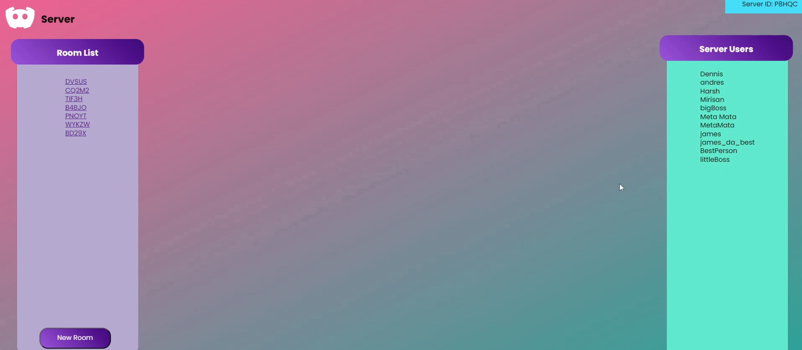
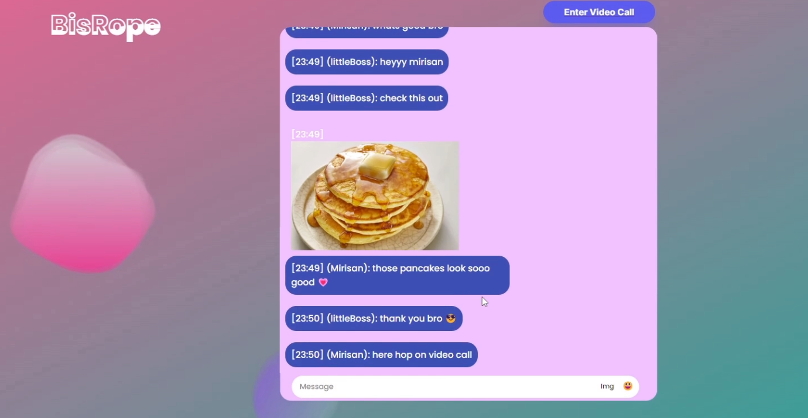

## Final Project for CSCI2020U

Developed by:

* [James Mata](https://github.com/JamesMeta)
* [Andres Cardoso](https://github.com/AndresCardosoP)
* [Dennis Martin](https://github.com/DMartinCodes)
* [Harsh Panchal](https://github.com/HarshPanchal01)
* [Mirisan Ravindran](https://github.com/MirisanRavindran)

## Project Description

BisRope is an advanced chatserver application that allows users to create servers that contain chat rooms so that they can communicate in an organized way. This system supports an unlimited number of servers and chat rooms within memory. BisRope also supports the ability to send photos and emojis to other users aswell as video calling between 2 users. BisRope works with a Restful API and a Websocket API to perform such actions.

This video demonstrates the functionality of the project https://www.youtube.com/watch?v=b8qguJ5WiyA

In this photo we can see the view from inside a server

From this photo we can see the view from inside a room inside a server

From this photo we can see the view from inside a video call

## Project Features

* Account creation
* Server creation and the ability to join pre-existing servers
* Room creation and the ability to join existing rooms
* Video calling between users
* Text messaging between users
* Image file transfer between users
* Emoji messaging between users

## How to use BisRope

Initially, the entire repository must be cloned, and a glassfish server must be set up. For the BisropeServer project run glassfish local with the url http://localhost:8080/BisRopeServer-1.0-SNAPSHOT/ with the war exploded airtifact and for the WSChat Project run a remote server with the url http://localhost:8080/WSChat-1.0-SNAPSHOT/login.html with the war artifact

Starting up the application in the order local -> remote you should be met with the login screen where your can create an account and login

## Libraries Used

Agora.io Sdk https://www.agora.io/en/
